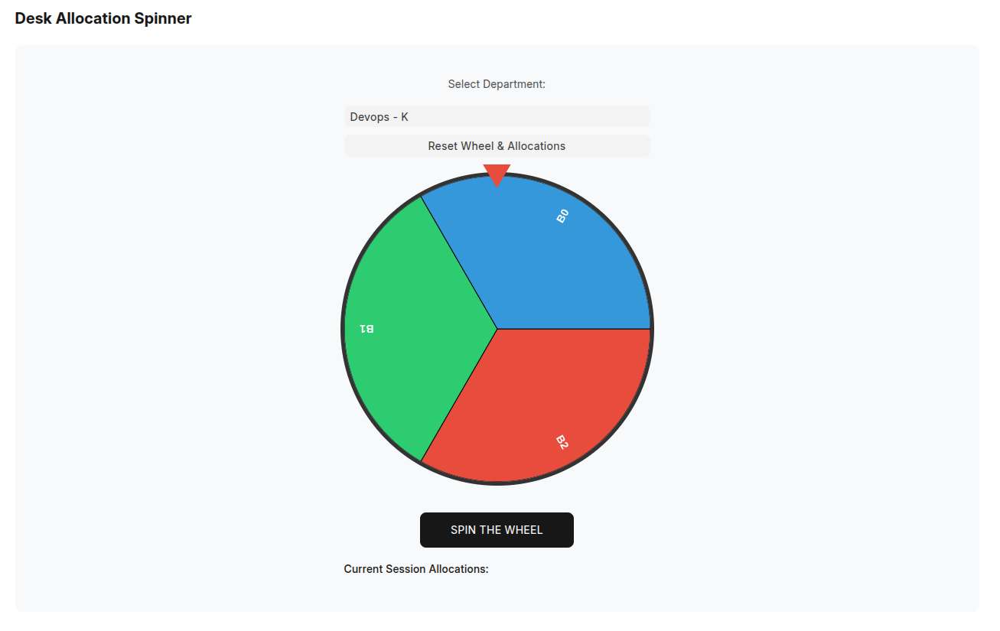
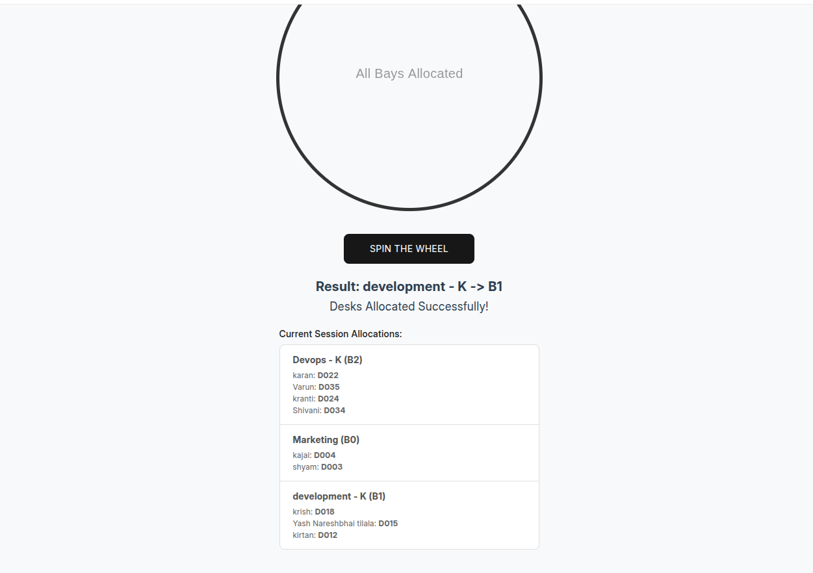

# Desk Allocation System 🎡

A custom Frappe application designed to simplify and gamify the complex process of office desk management and quarterly seating rearrangements.

### 🌟 Key Highlights

* **Gamified Team Assignment:** Uses an interactive HTML5 Canvas "Spinning Wheel" to assign Departments to specific Office Bays, making administrative tasks engaging.
* **Automated Randomization:** Eliminates bias in seating by using a Python-based randomization engine to pair employees with desks.
* **ERPNext Integrated:** Seamlessly pulls real-time data from ERPNext `Employee` and `Department` records.
* **Capacity-Aware Logic:** The system intelligently validates Bay capacity against Department size before allowing an allocation.
* **Conflict Prevention:** Built-in logic ensures no Bay is double-allocated and no Department spins twice in a single session.
* **Audit Trail:** Keeps a clear log of "Current Session Allocations" for transparency.

### 🛠️ Tech Stack
- **Backend:** Frappe (Python/MariaDB)
- **Frontend:** JavaScript (HTML5 Canvas, jQuery)
- **Framework:** Frappe Framework v14/v15





### Desk Allocator

this app randomize desk allocation to employees in company

### Installation

You can install this app using the [bench](https://github.com/frappe/bench) CLI:

```bash
cd $PATH_TO_YOUR_BENCH
bench get-app $URL_OF_THIS_REPO --branch develop
bench install-app desk_allocator
```

### Contributing

This app uses `pre-commit` for code formatting and linting. Please [install pre-commit](https://pre-commit.com/#installation) and enable it for this repository:

```bash
cd apps/desk_allocator
pre-commit install
```

Pre-commit is configured to use the following tools for checking and formatting your code:

- ruff
- eslint
- prettier
- pyupgrade

### License

mit
